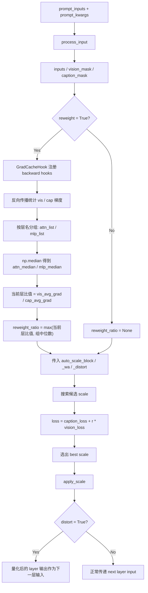

### flash-attn版本

flash_attn-2.8.3+cu12torch2.8cxx11abiTRUE-cp310-cp310-linux_x86_64


### 8b模型

```bash
ps -ef | grep main.py | grep -v grep

CUDA_VISIBLE_DEVICES=6 \
nohup \
python3 -W ignore main_quant.py \
    --config configs/internvl2/MBQ_search/my_8b_weight_only.yaml \
    > 8b_out_w2g64.log 2>&1  &


CUDA_VISIBLE_DEVICES=0 \
nohup \
python3 -W ignore main.py \
    --config configs/internvl2/Eval/my_eval.yaml \
    > 8b_eval_out_ocrbench_w2g128.log 2>&1  &

CUDA_VISIBLE_DEVICES=3 \
nohup \
python3 -W ignore main.py \
    --config configs/internvl2/Eval/my_eval.yaml \
    > 8b_eval_out_ocrbench_w2g32.log 2>&1  &


CUDA_VISIBLE_DEVICES=3 \
nohup \
python3 -W ignore main.py \
    --config configs/internvl2/Eval/my_eval_textvqa.yaml \
    > 8b_eval_out_textvqa_w2g32.log 2>&1  &
```

### 2b模型测试

CUDA_VISIBLE_DEVICES=2 \
nohup \
python3 -W ignore main_quant.py \
    --config configs/my-internvl2-2b/MBQ_search/2b_weight_only.yaml \
    > out.log 2>&1  &

CUDA_VISIBLE_DEVICES=2 \
nohup \
python3 -W ignore main.py \
    --config configs/my-internvl2-2b/Eval/eval.yaml \
    > eval_out.log 2>&1  &


### 子仓库下载

```bash
git submodule update --init --recursive

git submodule update --init --recursive 3rdparty/lmms-eval

git submodule update --init --recursive 3rdparty/LLaVA-NeXT

```

### 激活环境

conda activate mbq


### flash-attn安装

```bash
pip install --no-build-isolation --no-cache-dir flash-attn==2.8.3
```


## 记录


**结论**
你的判断基本成立，而且更准确地说，MBQ 不是从头设计的一套新结构，而是以 AWQ 为工程骨架做出来的多模态 fork。它不只是“看起来像”，而是连调度方式、逐层搜索方式、scale 应用方式都沿用了 AWQ 的模板。

**为什么这么判断**
- 调度层同构：在 quant_wrapper.py 里，awq 和 mbq 被放进同一个分发器；MBQ 只是在 quant_wrapper.py 开始多了 reweight、distort、loss_mode、wa_quant 这些额外开关。
- 入口层同构：AWQ 的 entry.py 和 MBQ 的 entry.py 都是“组 q_config -> 跑过程 -> 存或读 scale -> apply -> 伪量化”的同一条流水线；MBQ 只是多了 CPU/GPU 切换和联合量化分支。
- 核心搜索层同构：AWQ 的 pre_quant.py 和 MBQ 的 pre_quant.py 都是“抓第一层输入 -> 按层循环 -> 收集线性层输入特征 -> 搜索 scale -> 逐层应用”的同一模板。MBQ 在这个模板上额外加了多模态输入处理、梯度缓存、reweight 和 distort。
- 算法内核同构：两个 auto_scale.py 和 auto_scale.py 的主体都是 20 档网格搜索、state_dict 回滚、按 loss 选 best_ratio；MBQ 只是把 loss 改成了能区分视觉 token 和答案 token 的 mask-aware 版本。
- 基础模块同构：两边的 qmodule.py 和 qmodule.py 里的 ScaledActivation 是同一份实现，这说明不是“思路相似”，而是工程基元直接复用。

**MBQ 真正新增的东西**
- 额外文件：MBQ 多了 auto_scale_wa.py、auto_scale_distort.py、auto_scale_wa_distort.py，这些都是 AWQ 没有的分支。
- 额外量化后端：MBQ 的 quantizer.py 仍保留 weight-only 伪量化，但从 quantizer.py 开始新增了 pseudo_quantize_model_weight_act，再配合 auto_scale_wa.py 里的 WALinear.from_float，说明它已经扩展到 weight-activation 联合量化。
- 额外模型适配：MBQ 的 pre_quant.py 和 pre_quant.py 覆盖了更多 VLM 结构，并且加入了 pre_quant.py、pre_quant.py 这类多模态专用逻辑。

**怎么定性**
- 如果你说“MBQ 的文件结构和 AWQ 很像”，这是对的。
- 如果你说“MBQ 是 AWQ 的多模态 fork / 增强版”，这是最准确的。
- 如果你说“MBQ 只是 AWQ 改个名字”，那就不够准确，因为 MBQ 已经改了输入形态、损失定义、量化后端和模型适配。

**代价**
这种复用的代价是代码重复很高，AWQ 和 MBQ 的 bug 修复、模型适配、scale 逻辑很容易分叉，后续维护成本会明显上升。

如果你愿意，我可以继续把 AWQ 和 MBQ 做成一张逐文件对照表，或者直接画出它们的调用链差异图。


qmodule(awq)==qmodule(mbq)


## MBQ代码区别

### gpt-5.4-mini 的分析
我先把差异按“入口、校准目标、量化实现、支持模型”四个层次归纳一下，这样能直接看出 MBQ 不是 AWQ 的小改，而是把 AWQ 的单模态权重缩放流程扩展成了多模态、带重加权和带激活量化的版本。

从 diff 看，MBQ 不是对 AWQ 的小修补，而是把 AWQ 的“单模态、weight-only、基于答案 token 的层级缩放搜索”扩成了“多模态、可做 weight-activation quant、带重加权和失真传播模拟”的版本。核心框架还是 AWQ 的 layer-by-layer 搜索与 apply_scale，但目标函数、输入形态、支持模型和量化后端都变了。

**最关键的差异**
- 入口从 AWQ 的 prompt_tokens / prompt_mask，变成 MBQ 的 prompt_inputs / prompt_kwargs，并额外拆出 vision_mask 和 caption_mask。对应逻辑在 MBQ 的 pre_quant.py 里，说明它已经不再只面向纯文本。
- 目标函数从“只看答案 token 上的误差”变成“答案 token + 视觉 token 的可重加权误差”，而且支持 mae / mse 两种模式。这个变化主要在 MBQ 的 auto_scale.py 和后面的 loss 分支里。
- MBQ 增加了 GradCacheHook，先反向统计视觉和文本 token 的梯度强度，再用 attn / mlp 的中位数比值去调权重搜索的偏好。AWQ 没有这一步，这是 MBQ 最“方法论”上的扩展。
- MBQ 还加了 distort 路径，会把当前层量化后的误差继续传给后续层，用失真输入参与校准，模拟量化误差传播。AWQ 只做标准的逐层校准，不做这类额外扰动传播。
- MBQ 支持 weight-activation quantization：在 quantizer.py 里引入 WALinear 和 a_bit，把原来 AWQ 的权重量化流程升级成了权重+激活一起量化的入口。

**模型支持层面**
- MBQ 扩展了 get_blocks 和 move_embed，对 Qwen2VL、LlavaLlamaModel、LlavaQwen、InternVL 等多模态封装做了适配。
- 在 auto_scale.py 里还专门加了 Qwen2VLDecoderLayer 分支，并在归一化缩放那里补了 Qwen2RMSNorm 的处理，说明它是针对新模型结构补齐的。
- qmodule.py 基本没有实质差异，说明 MBQ 的变化主要不在底层算子，而在校准流程和量化策略编排上。

**一句话概括**
- AWQ 更像“文本模型的权重缩放校准器”。
- MBQ 更像“面向多模态模型的、带梯度重加权和激活量化能力的 AWQ 超集”。

### 进一步解释


你卡住的这句，核心不是“代码语法”，而是 MBQ 在 AWQ 之外多加了一条“先测敏感度，再拿敏感度去指导量化搜索”的流程。可以把它拆成 3 层来看。

1. 先理解 AWQ 在做什么  
AWQ 的主流程很简单：对每一层，拿输入特征去试不同的 scale，找一个让量化前后输出误差最小的 scale。它本质上是“逐层搜索最佳缩放系数”，目标主要是让答案 token 的输出尽量不变。这个基线在 awq 的 pre_quant.py 和 awq 的 auto_scale.py 里。

2. MBQ 额外加了什么  
MBQ 先做了一次反向统计，这就是你看到的 GradCacheHook，代码在 pre_quant.py。它做的事不是训练模型，而是“偷看”每一层对不同 token 区域有多敏感：

- 它在若干线性层上挂 backward hook。
- 反向传播时，hook 拿到的是该层输出的梯度，不是权重梯度。
- 再用 vision_mask 和 caption_mask 把梯度切成两部分：视觉 token 和文本 token。
- 分别计算这两部分梯度的平均绝对值，得到“这层对视觉 token 和文本 token 的敏感度”。

所以这一步的真实含义是：先估计“图像区域”和“文本区域”在每层里谁更重要，而不是直接改模型参数。

3. “attn / mlp 的中位数比值”是什么意思  
这部分在 pre_quant.py 附近。代码先把各层的视觉梯度 / 文本梯度比值收集起来，然后分成 attention 组和 MLP 组，各自取一个中位数。这里用中位数，是为了避免少数极端层把比例拉歪。

更准确地说，它不是把这个比值直接当最终权重，而是拿它做“下限”：

- 对某一层，先算它自己的 vis / cap 比值。
- 再和该组的中位数比。
- 最终取较大的那个。

也就是说，MBQ 不是完全按某一层的局部噪声走，而是“局部比值 + 组内稳健基线”一起决定权重。

你可以把它理解成一个公式：

$$
r_{\text{layer}} = \max\left(\frac{\overline{g}_{vis}}{\overline{g}_{cap}}, \text{median}_{group}\right)
$$

然后在量化搜索时把视觉部分的损失乘上这个 $r_{\text{layer}}$。

4. 这个权重到底怎么用到 scale 搜索里  
真正搜索 scale 的地方在 auto_scale.py。MBQ 把 AWQ 原来“只看答案 token”的 loss，扩成了“答案 token + 视觉 token”的双区域 loss。

如果有 vision_mask 和 caption_mask，它就会同时算两部分误差：

$$
L = L_{\text{caption}} + r \cdot L_{\text{vision}}
$$

这里 $r$ 就是前面算出来的 reweight_ratio。  
如果没开 reweight，或者没有 vision_mask，它就退回到 AWQ 风格，只看答案区域，行为基本兼容。

5. distort 分支在干什么  
这也是 MBQ 比 AWQ 多的一步，代码在 pre_quant.py 和后面的 pre_quant.py 附近。

它的意思是：  
当前层校准完之后，不是把“干净输入”继续传给下一层，而是把“经过量化层后的输出”传下去。这样后面的层做校准时，看到的是已经带有前面量化误差的输入。

这一步的作用是模拟误差累积。  
AWQ 通常是逐层独立校准，MBQ 则更接近“把前面层的量化失真也算进去”。

6. wa_quant 是什么  
MBQ 还支持权重 + 激活联合量化，不只是 weight-only。对应入口在 quantizer.py。  
当 wa_quant 打开时，它会把普通 Linear 替换成 WALinear，这意味着它已经不是 AWQ 那种纯权重量化路线了，而是更完整的 weight-activation 路线。

一句话总结一下：

AWQ 是“只做逐层权重缩放，尽量让答案 token 的输出不变”。  
MBQ 是“先用反向梯度估计图像和文本的重要性，再把这个重要性反馈到逐层 scale 搜索里，还可以额外模拟失真传播，并支持激活量化”。

如果你愿意，我下一步可以把这条链路按函数调用顺序画成一张非常直观的流程图，直接对应到代码里的每个函数。

### 流程图



这张图里最关键的是两条线：
- `reweight_ratio` 这条线负责“给视觉/文本误差分配权重”。
- `distort` 这条线负责“把前面层的量化误差继续传下去”。

---

### 中位数计算的细节

这里的“该组的中位数”，不是对 token 求中位数，而是对“同一类层”的一组标量比值求中位数。

对应代码在 pre_quant.py 到 pre_quant.py：

- 先给每一层算一个比值  
  $r_l = \frac{\text{vis\_avg\_grad}}{\text{cap\_avg\_grad}}$
- 然后按层名分组：
  - 名字里包含 `o_proj` 或 `wo` 的，放进 attention 组，进入 `attn_list`
  - 名字里包含 `down_` 或 `w2` 的，放进 MLP 组，进入 `mlp_list`
- 最后对这个列表直接用 np.median 求中位数。

np.median 的规则是：

- 如果元素个数是奇数，取排序后正中间那个
- 如果元素个数是偶数，取中间两个数的平均值

所以它本质上是“这一组所有层的梯度比值”的稳健中心值，不是按样本算，也不是按 token 算。

举个例子，假设 attention 组算出来的比值是：

$$[0.8, 1.0, 1.2, 3.0]$$

那么中位数就是：

$$\frac{1.0 + 1.2}{2} = 1.1$$

之后在每一层真正做 reweight 时，代码会用当前层自己的比值和这个组中位数比较，取较大的那个。也就是 pre_quant.py 到 pre_quant.py 里的逻辑：

$$r_{\text{layer}} = \max(r_{\text{current}}, r_{\text{group-median}})$$

如果你愿意，我可以继续把“为什么这里要用中位数而不是平均数”也给你解释清楚。

---

### 常见疑问：weight-only 量化为什么收集输出梯度而不是权重梯度？

**核心理解**：scale search 优化的是**输出激活误差**，而不是权重误差。

在 auto_scale.py 的 `_search_module_scale` 里，流程是：

```
scale → 量化权重 → 前向传播 → 比较 org_out 和 quant_out
```

loss 定义为 $\|\text{org\_out} - \text{quant\_out}\|$，定义在**输出空间**上。所以即使做 weight-only quantization，搜索目标仍然是输出层面的误差最小化。

**为什么用输出梯度来指导这个搜索？**

输出梯度 $\frac{\partial \mathcal{L}}{\partial \mathbf{h}^{(l)}}$ 的含义是：

> 如果在第 $l$ 层的某个 token 位置的输出上扰动 $\epsilon$，最终 loss 大约变化 $\epsilon \cdot \frac{\partial \mathcal{L}}{\partial \mathbf{h}^{(l)}}$

权重被量化后，输出 $\mathbf{h}^{(l)}$ 会产生扰动 $\Delta \mathbf{h}$。不同 token 位置对这个扰动的敏感度不同：
- 梯度幅度大的位置 → 扰动会被放大到最终 loss → 量化时必须优先保护
- 梯度幅度小的位置 → 对扰动不敏感 → 可以容忍更大误差

所以用输出梯度的幅度来加权输出误差，本质上是：

$$
\text{weighted\_loss} = \sum_{\text{token } t} \underbrace{\left\| \frac{\partial \mathcal{L}}{\partial \mathbf{h}_t} \right\|}_{\text{敏感度}} \cdot \underbrace{\|\Delta \mathbf{h}_t\|}_{\text{量化带来的输出扰动}}
$$

**那权重梯度能不能用？**

权重梯度 $\frac{\partial \mathcal{L}}{\partial W}$ 告诉你"哪些权重重要"，但它不直接告诉你"这些权重影响了哪些 token"。要把权重重要性映射回 token 空间需要额外链式展开（$\frac{\partial \mathcal{L}}{\partial W} = \frac{\partial \mathcal{L}}{\partial \mathbf{h}} \cdot x^T$），信息粒度和可解释性都不如直接用输出梯度按 token 拆分。

---

### 常见疑问：reweight_ratio 用到 scale 搜索里怎么理解？

**从代码看**（auto_scale.py MAE 模式）：

```
masked_diff_ans = |org_out - out| * ans_mask
masked_diff_vis = |org_out - out| * vis_mask
loss = (sum(ans_diff) + reweight_ratio * sum(vis_diff)) / (N_ans + N_vis)
```

等价形式：

$$
\mathcal{L} = \frac{1}{N_{\text{ans}} + N_{\text{vis}}} \left( \sum_{t \in \text{ans}} |\Delta \mathbf{h}_t| \;+\; r \cdot \sum_{t \in \text{vis}} |\Delta \mathbf{h}_t| \right)
$$

**直观理解**：用一个具体例子说明——

| 候选 scale | 答案区域误差 | 视觉区域误差 |
|-----------|------------|------------|
| A         | 0.01       | 0.05       |
| B         | 0.03       | 0.01       |

- **AWQ（只看答案）**：选 A，因为答案误差更小
- **MBQ（reweight_ratio=3，视觉更需要保护）**：
  - A 的总 loss = 0.01 + 3×0.05 = 0.16
  - B 的总 loss = 0.03 + 3×0.01 = 0.06
  - **选 B**

reweight_ratio 的作用就是告诉 scale search："在最小化输出误差的时候，视觉区域的重要性是答案区域的 r 倍"。r 来自梯度统计——如果视觉 token 的梯度幅度更大，说明模型对视觉区域的输出扰动更敏感，必须更小心保护。

**物理类比**：把 scale search 想象成"在预算有限的情况下分配保护力度"——
- 量化一定会引入误差（预算有限）
- 输出梯度告诉你"哪里受伤会更疼"
- reweight_ratio 就是把"疼痛敏感度"编码进 loss，让搜索算法自动把误差分配到"不那么疼"的区域